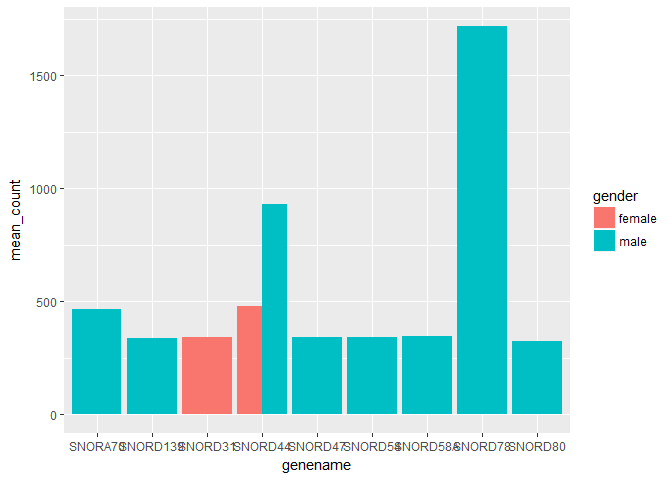
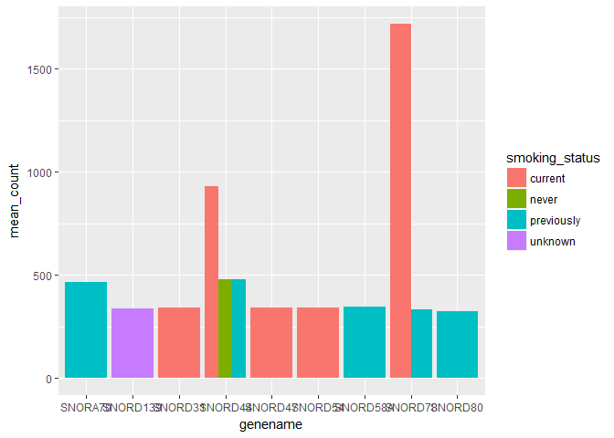
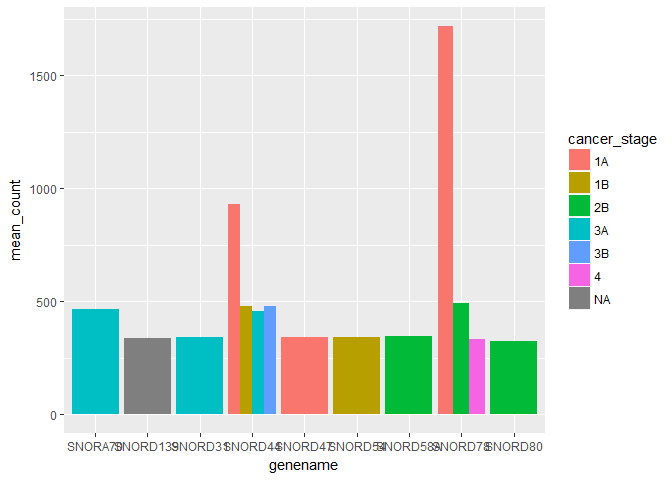

Analysis Report 2: Implications of SNOR-family Genes in Non-small Cell Lung Cancer
================
Allison Bogisich
November 15, 2017

Introduction
============

One of the most longstanding symptoms of cancer has been increased rates of cellular structure synthesis, as cancer cells are prone to exhibit specific alterations in their metabolic activities. Cancer is predicted to kill approximately 595,690 Americans in 2016, equating to about 1,630 people per day according to the American Cancer Society. Cancer-associated metabolic reprogramming occurs in order to support the increased production of cells via necessary increased rates of biosynthesis of proteins, nucleic acids, and aforementioned lipids (Baenke *et al.*, 2013). However, not until relatively recently has research delving into the metabolic processes involved in lipid biosynthesis and their regulation- within the context of human disease- sustained much traction. The unique connection between lipid metabolism and cancer in humans lies within its linkage to epidermal growth factor (EGF) proteins and their receptors (Normanno *et al.*, 2006). Non-small cell lung cancer for example, is EGF specific and characterized by dramatic changes specifically in phospholipid profiles (Marien *et al.*, 2015). In 2017, non-small cell lung cancer is the most prevalent type of lung cancer, accounting for about 85 % of all lung cancer cases in the USA according to the American Cancer Society.There are many human lipid metabolism disorders associated with aberrant lipid homeostasis besides cancers, including but not limited to:Gaucher’s disease, Faber’s disease, Wolman’s disease and many others (Saltiel and Kahn, 2001, Madhusudan *et al.* (2004),Chanarin *et al.* (1975)). While these diseases are fairly rare, there are few current options for treatment and the survival rates-with decent quality of life-are quite low.

SNORAs and SNORDs are small non-coding RNAs involved in RNA processing and nogalamycin biosynthesis. This biosynthesis of noglamycin is critical to anti-tumor and antibiotic functionality of cellular maintenance. Both types have been found to be dysregulated in various types of cancer and have been implicated in not only the development but also the progressions of human cancer malignancy. This additional analysis will be based on data derived from the previous work of Li and Seo et al. in non-small cell cancer patients. I hypothesize that the expression of SNOR-genes in the patient tissues examined by Li and Seo et al. will show a marked flux in their levels of expression. That in the patients will later stage cancers, there will be more expression relative to the earlier stage cancer patients. I also predict that the smoking patients will have a higher degree of abberant expression than that of the non-smokers, due to the additional carcinogens found in tobacco products (Freour *et al.*, 2008).

Methods
=======

Sample origin and sequencing
----------------------------

The work of Li and her team (Li *et al.*, 2015) included data from the first large scale RNA sequencing study of lung adenocarcinoma by Seo et al. (Seo *et al.*, 2012). Paired surgical samples of both cancerous lung tissue and non-cancerous tissue were taken from 200 Korean patients. Only eighty-seven samples were then sequenced using RNA-seq and the Illumina TruSeq SBS Kit v3 on a HiSeq 2000 sequencer (Illumina Inc.) to obtain 100-bp paired-end reads. Of the 87 individuals whose cancer specimens were screened and sequenced, smoking history prior to diagnosis of lung cancer was provided by only 83 (47 smokers, 36 never-smokers, and four of unknown history).They were then aligned and read based on the NCBI human reference genome assembly build (build 37.1). Li et al. then downloaded Seo et al.'s RNA sequencing and phenotypic metadata for 68 patients(with 34 validated smoking and 34 non-smoking histories) from Gene Expression Omnibus (GEO) with accession number GSE40419. Comparisons were conducted based on phenotypes, including age at diagnosis,gender, and smoking history which are available from the public website (<http://genome.cshlp.org/content/22/11/2109/suppl/DC1>). Additionally, in order to validate genes identified in the nonsmoker group, independent RNA-seq data from six non-smoker patients were also downloaded from another GEO with accession number GSE37765 (Kim *et al.*, 2013). Differential gene expression analysis was then conducted between paired normal and tumor tissue using R Bioconductor and edgeR. Genotype calling was done for single-nucleotide variants, from RNA-seq bam files, with pair-end RNA-seq reads aligned to human genome assembly Ensembl GRCh37 by Tophat.

Computational
-------------

In order to analyze the data from Li et al., a series of both R and bash scripts were run. In the first script, the NCBI data set downloaded (using 'aspera' and 'sra-toolkit' for added efficiency) can be found here:<http://ftp-trace.ncbi.nlm.nih.gov/sra/sdk/current/sratoolkit.current-ubuntu64.tar.gz>. The second script facilitated the downloading of the *Homo sapien* genome via the 'Biomartr' package (Drost and Paszkowski,2017). Output was then piped into 'Ref-seq'so that we could quickly acquire all the reference genome (RNA and annotations). Subsequently, the third script contains the export path and simple for-loop that converted .sra to .fastq format and put it into our output directory. Next in the pipe was converting sequences to k-mers and building an index to map against the original reference DNA for use with 'Sailfish'(Patro *et al.*, 2014). Then a large amount of time was allotted for running fastqc on all fastq files and saving output to output directory, using 86 threads. Once complete, the large data set was trimmed to one of a more manageable size using 'trimmomatic' on paired-end DNA sequences in order to get rid of Illumina tags, gummy ends, suspicious quality sequences (Bolger *et al.*, 2014). Code checks were run to ensure completion of trimming step prior to running of 'Sailfish', which trimmed out base names while reading and running prior to output. All aforementioned steps were completed in TMUX, and all subsequently described steps were done in R 3.4.2 and R studio using version 1.1.383. The final script consolidated counts by matching transcript identifiers to the gene name and pooling them all together at the gene level prior to counting the number of reads that have mapped to the gene. The output table was then melted with the metadata table to create our final\_table for use in exploratory data analysis using 'tidyr', in order to create more data parsing friendly long-form data . The 'ggplot2' package could then be used for visualization of data into graphic results.

Results
=======

``` r
# here I want to pull out just the top 15 genes that either 
#  SNORA- or SNORD- in their base name 
# have to filter it out as a subset from final_table
snor_genes <- final_table %>%
  filter(grepl("SNOR", genename)) %>%
  group_by(genename) %>%
  summarize(mean_count = mean(counts_lengthscaledtpm)) %>%
  arrange(desc(mean_count)) %>%
  head(15)

# then we can use the `kable()` function to make a nicely formatted
# markdown table
snor_genes %>%
  kable()
```

| genename    |                                                                         mean\_count|
|:------------|-----------------------------------------------------------------------------------:|
| SNORD44     |                                                                           182.13109|
| SNORD78     |                                                                           176.42733|
| SNORA70     |                                                                           165.54947|
| SNORD47     |                                                                           137.57211|
| SNORD80     |                                                                           111.26334|
| SNORD54     |                                                                           100.49854|
| SNORA8      |                                                                            95.92445|
| SNORD58A    |                                                                            85.97906|
| SNORA67     |                                                                            85.53549|
| SNORD5      |                                                                            84.40541|
| SNORD31     |                                                                            83.66393|
| SNORA25     |                                                                            77.23478|
| SNORA40     |                                                                            74.90999|
| SNORA61     |                                                                            73.36901|
| SNORD139    |                                                                            69.89322|
| **Table 1** |  : The most highly expressed SNOR-family genes across all patients of both genders.|

Out of a total of 297 SNOR-family genes identified in patient lung tissue samples, the breakdown between the fifteen most represented by average sequence count was not quite even. There were nine SNORD- genes to only six SNORA-genes. Total counts per type of SNORA- and SNORD-genes were 129 and 168 respectively.

 **Figure 1**: Highest expressed SNOR-genes by gender representation.

When the SNOR-genes with the greatest mean count within the experimental group are categorized by gender, there is a strong divide along the gender line. Based on the nine highest expressed SNOR-genes visualized in Fig.1, only one of them had the highest rate of expression in females. The other eight had higher expression in males, and were exclusively being expressed in males for seven. The SNORD78 gene had the highest mean count at an almost thousand count average.

 **Figure 2**: Highest expressed SNOR-genes by smoking status of patients.

The homogeneity seen when grouping the most expressed SNOR-genes by gender is much stronger than when expression levels are categorized by smoking status of the patients. Patients that were currently smoking at the time of the study had five SNOR-genes being highly expressed relative to other groups of other status, with the highest mean counts of all genes. Previous smokers had equivalent rates of over-expressing SNOR-genes, with five genes being over-expressed within the group, and the third highest mean count across all statuses. Patients whom had reportedly never smoked or had no history collected were only represented in two of the SNOR-genes with the highest mean counts. The gene SNORD44 had most variety for representation by smoking status, with current, previous, and non-smokers all having high expression rates.

 **Figure 3**: Highest expressed SNOR-genes by cancer stage of patients.

When the stage of cancer at the time of tissue sampling is considered, the trends run almost parallel to when the genes were grouped by smoking status. However, the genes which were most expressed by current smokers were largely only at early stages of lung cancer (1A, 1B or 2B). The patients at the latter cancer stages (3A-4), did not exhibit the highest mean counts across genes. They did appear in six of the nine genes though, making of the majority of over-expressed SNOR-genes. Again, the SNORD44 gene showed great variability in cancer stage as it did when grouped by smoking status. It had one of the highest mean counts for four stages of cancer, while SNORD78 followed closely with three stages represented.

``` r
# take out just snor family genes from final table
# for count of total snor-genes represented
final_snor <- final_table %>%
  filter(grepl("SNOR", genename)) %>%
  group_by(genename) %>%
  summarize(mean_count = mean(counts_lengthscaledtpm)) %>%
  arrange(desc(mean_count)) %>%
  ungroup() %>%
  select(genename) %>%
  unique() %>%
  pull()
```

``` r
# this will pull out just SNORA-genes
# for total count represented in patients
snora_genes <- final_table %>%
  filter(grepl("SNORA", genename)) %>%
  group_by(genename) %>%
  summarize(mean_count = mean(counts_lengthscaledtpm)) %>%
  arrange(desc(mean_count)) %>%
  ungroup() %>%
  select(genename) %>%
  unique() %>%
  pull()
```

``` r
# this will pull out just SNORD-genes
# for total count represented in patients
snord_genes <- final_table %>%
  filter(grepl("SNORD", genename)) %>%
  group_by(genename) %>%
  summarize(mean_count = mean(counts_lengthscaledtpm)) %>%
  arrange(desc(mean_count)) %>%
  ungroup() %>%
  select(genename) %>%
  unique() %>%
  pull()
```

Discussion
==========

Given the relatively large number of genes within the SNOR-family that were undergoing high rates of expression and gene amplification in lung cancer patients, it supports my hypothesis that they have a contributing role in the complexity that is cancer development. That there were more SNORD-genes with the highest mean counts could be explained by the sheer fact that there were simply a greater number of them being represented in the samples of patients within Li et al.'s data set (Table 1). Whether there is statistical significance to their greater representation would require a larger sample size of patients of all different cancer stages and smoking statuses. However, my prediction that the patients with later stage cancers does not appear to be supported by the data. Instead, the SNOR-genes with the highest rates of amplification were from patients with early stage cancers (Fig. 3). This suggests that SNOR-genes are being most actively expressed in earlier stages of cancer and tumor development and likely confer an initial growth advantage for the cancerous cells that later becomes dampened as the tumors reach more advanced stages where growth and replication has reached a critical mass of cancerous cells. Conversely, the data supports the prediction that non-smoking patients and even patients who previously smoked would have lower rates of SNOR-gene expression relative to patients which were currently smoking (Fig. 2). Patients which had a on-going smoking habit exhibited the highest mean rates of gene amplification by far. These results demonstrate a larger variation in gene expression level in smoker patients which supports the finding from both Li and Seo’s studies. Along the gender line, male lung adenocarcinoma patients were undergoing much higher amplification of SNOR-genes than that of female cancer patients (Fig. 1). Currently, there is little biological evidence to support why there is such a large discrepancy across genders in over-expression of SNOR-genes. The main source of support is likely that there are simply far more male smokers than there are female smokers, which would be reflected in the pool of patients. According to the World Health Organization, globally, about 40% of men smoke as compared with nearly 9% of women (<http://www.who.int/gender/documents/10facts_gender_tobacco_en.pdf>). Future comparative studies would benefit by utilizing data sets with equivalent numbers of men and women.

Gene amplification and the consequent over-expression of amplified oncogenes have a critical role in the development of tumors, since their over-expression confers a foundation growth advantage. The ability to identify those cancerous genes that are activated during early stages of tumor production could facilitate a better ability for creating molecular genetic targets for both earlier cancer diagnosis and improved treatment therapy for the disease (Li *et al.*, 2006). Non-coding RNAs (ncRNAs), such as SNORDs, are important regulatory molecules involved in multiple physiological cellular processes. Any alterations of ncRNAs, can have a big impact on rates of tumorigenesis (Mannoor *et al.*, 2012). Mannnoor's research also found that evidence has been accumulating which supports that small nucleolar RNAs (snoRNAs), another large class of ncRNAs, are much more active participants in carcinogenesis than was previously thought. Some snoRNAs exhibit differential expression patterns in a variety of human cancers and demonstrate capability to affect not only cell transformation, but also tumorigenesis, and metastasis. Given their roles in diverse cellular processes, additional research to determine differential expression patterns of cancer type-specific snoRNAs could find novel cancer biomarkers. Previous research has demonstrated that SNORs are present in stable forms and consistently measurable in blood plasma (Fortunato *et al.*, 2014). Therefore, SNORs have great potential for further research that creates profiles based on fluid-based biomarkers for specific cancer detection.

Sources Cited
=============

Baenke,F. *et al.* (2013) Hooked on fat: The role of lipid synthesis in cancer metabolism and tumour development. *Disease models & mechanisms*, **6**, 1353–1363.

Bolger,A.M. *et al.* (2014) Trimmomatic: A flexible trimmer for illumina sequence data. *Bioinformatics*, **30**, 2114–2120.

Chanarin,I. *et al.* (1975) Neutral-lipid storage disease: A new disorder of lipid metabolism. *British medical journal*, **1**, 553.

Fortunato,O. *et al.* (2014) Assessment of circulating microRNAs in plasma of lung cancer patients. *Molecules*, **19**, 3038–3054.

Freour,T. *et al.* (2008) Active smoking compromises ivf outcome and affects ovarian reserve. *Reproductive biomedicine online*, **16**, 96–102.

Kim,S.C. *et al.* (2013) A high-dimensional, deep-sequencing study of lung adenocarcinoma in female never-smokers. *PloS one*, **8**, e55596.

Li,R. *et al.* (2006) Identification of putative oncogenes in lung adenocarcinoma by a comprehensive functional genomic approach. *Oncogene*, **25**, 2628–2635.

Li,Y. *et al.* (2015) RNA-seq analysis of lung adenocarcinomas reveals different gene expression profiles between smoking and nonsmoking patients. *Tumor Biology*, **36**, 8993–9003.

Madhusudan,S. *et al.* (2004) A multicenter phase i gene therapy clinical trial involving intraperitoneal administration of e1a-lipid complex in patients with recurrent epithelial ovarian cancer overexpressing her-2/neu oncogene. *Clinical Cancer Research*, **10**, 2986–2996.

Mannoor,K. *et al.* (2012) Small nucleolar rnas in cancer. *Biochimica et Biophysica Acta (BBA)-Reviews on Cancer*, **1826**, 121–128.

Marien,E. *et al.* (2015) Non-small cell lung cancer is characterized by dramatic changes in phospholipid profiles. *International journal of cancer*, **137**, 1539–1548.

Normanno,N. *et al.* (2006) Epidermal growth factor receptor (egfr) signaling in cancer. *Gene*, **366**, 2–16.

Patro,R. *et al.* (2014) Sailfish enables alignment-free isoform quantification from rna-seq reads using lightweight algorithms. *Nature biotechnology*, **32**, 462–464.

Saltiel,A.R. and Kahn,C.R. (2001) Insulin signalling and the regulation of glucose and lipid metabolism. *Nature*, **414**, 799–806.

Seo,J.-S. *et al.* (2012) The transcriptional landscape and mutational profile of lung adenocarcinoma. *Genome research*, **22**, 2109–2119.
